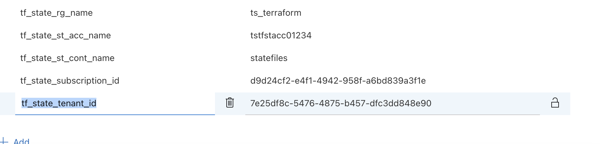

# Introduction

To be updated 

# Pre-requisites
 - Make sure to create a storage account, since we store terraform statefile into storage account
 - Whatever the storage account details, please store them into these global variables
 
 * tf_state_rg_name
 * tf_state_rg_name
 * tf_state_st_cont_name
 * tf_state_subscription_id
 * tf_state_tenant_id

# Folder Structure
- Modules - which contains modules of terraform
- Pipeline - this folder contains pipeline
- Terraform - this folder contains actual terraform project files ( main.tf, var.tf, provider.tf, backend.tf)

# Pipeline
- 